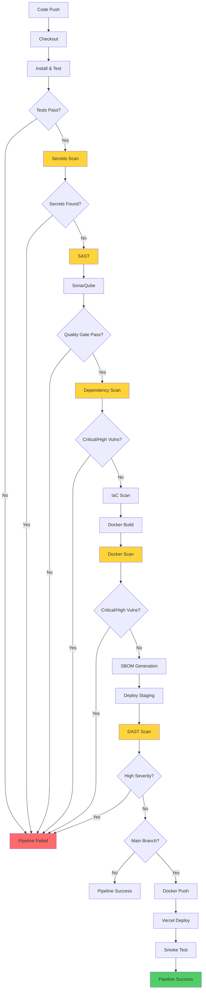

# Pipeline « To-Be » Documentation

Ce document décrit l'état du pipeline CI/CD **après** l'implémentation des contrôles de sécurité DevSecOps. Il représente l'état cible avec tous les contrôles de sécurité intégrés.

## Vue d'ensemble du Pipeline

Le pipeline « to-be » implémente une approche DevSecOps complète avec des contrôles de sécurité intégrés à chaque étape du cycle de vie du développement.

## Diagramme du Pipeline

## Étapes du Pipeline

### 1. Checkout
- **Outil**: Git (Jenkins checkout step)
- **Objectif**: Récupérer le code source du dépôt
- **Contrôles de sécurité**: Validation de l'intégrité du dépôt

### 2. Install and Test
- **Outils**: pip, pytest, coverage
- **Objectif**: Installer les dépendances et exécuter les tests
- **Contrôles de sécurité**:
  - Tests unitaires avec couverture de code
  - Rapport de couverture pour SonarQube
  - **Bloquant**: Les tests doivent réussir

### 3. Secrets Scan (Gitleaks)
- **Outil**: Gitleaks (Docker: zricethezav/gitleaks:v8.18.0)
- **Objectif**: Détecter les secrets exposés dans le code
- **Contrôles de sécurité**:
  - Scan de l'historique Git complet
  - Scan de l'arborescence de travail
  - **Bloquant**: Tout secret trouvé bloque le pipeline
- **Rapport**: JSON archivé comme artefact

### 4. SAST (Static Application Security Testing)

#### 4a. Semgrep
- **Outil**: Semgrep (Docker: returntocorp/semgrep:1.45.0)
- **Objectif**: Analyse statique focalisée sur la sécurité
- **Contrôles de sécurité**:
  - Règles personnalisées pour Flask/Python
  - Règles auto (bibliothèque Semgrep)
  - **Bloquant**: Critique/High, **Avertissement**: Medium/Low
- **Rapport**: JSON archivé comme artefact

#### 4b. Bandit
- **Outil**: Bandit (Docker: python:3.11-slim)
- **Objectif**: Analyse de sécurité Python
- **Contrôles de sécurité**:
  - Détection de fonctions dangereuses (exec, eval)
  - Détection de secrets hardcodés
  - Détection d'algorithmes cryptographiques faibles
  - **Bloquant**: Critique/High, **Avertissement**: Medium/Low
- **Rapport**: JSON archivé comme artefact

#### 4c. SonarQube
- **Outil**: SonarQube Scanner
- **Objectif**: Analyse de qualité de code et sécurité
- **Contrôles de sécurité**:
  - Analyse de bugs et vulnérabilités
  - Hotspots de sécurité
  - Couverture de code
  - **Bloquant**: Quality gate configuré
- **Rapport**: Dashboard SonarQube (http://localhost:9000)

### 5. SonarQube Quality Gate
- **Outil**: SonarQube waitForQualityGate
- **Objectif**: Valider les critères de qualité
- **Critères**:
  - Pas de nouveaux bugs
  - Pas de nouvelles vulnérabilités
  - Pas de nouveaux hotspots de sécurité non revus
  - Couverture ≥ 80% sur le nouveau code
- **Bloquant**: Échec du quality gate bloque le pipeline

### 6. Dependency Scan (Trivy)
- **Outil**: Trivy (Docker: aquasec/trivy:0.47.0)
- **Objectif**: Scanner les dépendances pour vulnérabilités
- **Contrôles de sécurité**:
  - Scan des fichiers et dépendances
  - CVSS scores pour chaque vulnérabilité
  - **Bloquant**: Critique/High (CVSS ≥ 7.0)
  - **Avertissement**: Medium/Low (pipeline UNSTABLE)
- **Rapport**: JSON archivé comme artefact

### 7. IaC Scan (Checkov)
- **Outil**: Checkov (Docker: bridgecrew/checkov:3.2.65)
- **Objectif**: Scanner l'infrastructure-as-code
- **Contrôles de sécurité**:
  - Validation du Dockerfile
  - Meilleures pratiques de sécurité
  - **Non-bloquant**: Pipeline devient UNSTABLE
- **Rapport**: JSON archivé comme artefact

### 8. Docker Build
- **Outil**: Docker
- **Objectif**: Construire l'image Docker
- **Contrôles de sécurité**:
  - Multi-stage build
  - Utilisateur non-root
  - Pas de secrets intégrés
  - **Bloquant**: Échec du build bloque le pipeline

### 9. Docker Scan (Trivy)
- **Outil**: Trivy (Docker: aquasec/trivy:0.47.0)
- **Objectif**: Scanner l'image Docker pour vulnérabilités
- **Contrôles de sécurité**:
  - Scan des couches de l'image
  - Scan des packages installés
  - **Bloquant**: Critique/High (CVSS ≥ 7.0)
  - **Avertissement**: Medium/Low (pipeline UNSTABLE)
- **Rapport**: JSON archivé comme artefact

### 10. SBOM Generation (Syft)
- **Outil**: Syft (Docker: anchore/syft:0.103.0)
- **Objectif**: Générer la Software Bill of Materials
- **Contrôles de sécurité**:
  - Inventaire complet des dépendances
  - Format CycloneDX JSON
  - **Non-bloquant**: Informationnel
- **Rapport**: JSON archivé comme artefact

### 11. Deploy Staging
- **Outil**: Docker
- **Objectif**: Déployer en environnement de staging
- **Contrôles de sécurité**:
  - Conteneur isolé sur réseau staging
  - Variables d'environnement injectées
  - **Bloquant**: Échec du déploiement bloque le pipeline

### 12. DAST (OWASP ZAP)
- **Outil**: OWASP ZAP (Docker: zaproxy/zap-stable:2.15.0)
- **Objectif**: Analyse dynamique de sécurité
- **Contrôles de sécurité**:
  - Scan baseline contre endpoint staging
  - Détection de vulnérabilités runtime
  - **Bloquant**: High severity
  - **Avertissement**: Medium/Low (pipeline UNSTABLE)
- **Rapport**: HTML et JSON archivés, HTML publié

### 13. Docker Push (Main branch only)
- **Outil**: Docker Hub
- **Objectif**: Pousser l'image validée vers Docker Hub
- **Contrôles de sécurité**:
  - Uniquement sur branche main
  - Seulement après validation de tous les gates
  - Authentification avec token Docker Hub
  - **Bloquant**: Échec du push bloque le pipeline
- **Tags**: `<commit-sha>` et `latest`

### 14. Deploy Vercel (Main branch only)
- **Outil**: Vercel CLI
- **Objectif**: Déployer l'application sur Vercel
- **Contrôles de sécurité**:
  - Uniquement sur branche main
  - Variables d'environnement Vercel
  - Smoke test du déploiement
  - **Bloquant**: Échec du déploiement bloque le pipeline

## Outils Utilisés

| Outil | Version Docker | Type | Stage |
|-------|---------------|------|-------|
| Gitleaks | zricethezav/gitleaks:v8.18.0 | Secrets Scan | Secrets Scan |
| Semgrep | returntocorp/semgrep:1.45.0 | SAST | SAST |
| Bandit | python:3.11-slim | SAST | SAST |
| SonarQube | SonarQube Scanner | Code Quality | SAST + Quality Gate |
| Trivy | aquasec/trivy:0.47.0 | SCA/Container Scan | Dependency Scan + Docker Scan |
| Checkov | bridgecrew/checkov:3.2.65 | IaC Scan | IaC Scan |
| Syft | anchore/syft:0.103.0 | SBOM | SBOM |
| OWASP ZAP | zaproxy/zap-stable:2.15.0 | DAST | DAST |

## Critères de Qualité

### Bloquant (Pipeline Failed)
- Tout secret détecté
- Vulnérabilités Critique/High (CVSS ≥ 7.0)
- Échec des tests unitaires
- Échec du quality gate SonarQube
- Échec du build Docker
- Vulnérabilités High dans scan DAST

### Avertissement (Pipeline Unstable)
- Vulnérabilités Medium/Low (CVSS < 7.0)
- Problèmes IaC (Checkov)
- Problèmes de code qualité non critiques

### Non-bloquant
- Génération SBOM
- Problèmes de configuration mineurs

## Rapports et Archivage

### Rapports Générés
- `gitleaks-report.json` - Secrets scan
- `semgrep-report.json` - SAST Semgrep
- `bandit-report.json` - SAST Bandit
- `trivy-fs-report.json` - Dependency scan
- `checkov-report.json` - IaC scan
- `trivy-image-report.json` - Container scan
- `sbom.json` - Software Bill of Materials
- `zap-report.html/json` - DAST scan
- `coverage.xml/html` - Test coverage

### Archivage
- Tous les rapports archivés comme artefacts Jenkins
- Rapports HTML publiés via HTML Publisher
- Rétention configurable (par défaut 30 jours)
- Fingerprinting pour traçabilité

## Notifications

### États de Pipeline
- **SUCCESS**: Tous les gates de sécurité passés
- **FAILURE**: Gate bloquant échoué
- **UNSTABLE**: Gate non-bloquant échoué

### Mécanisme de Notification
- Email avec détails du pipeline
- Inclut: nom du job, numéro de build, commit SHA, durée, statut
- Liens vers les rapports et build URL
- Destinataires configurés via `$DEFAULT_RECIPIENTS`

## Comparaison As-is vs To-be

| Aspect | As-is | To-be |
|--------|-------|-------|
| Stages | 5 | 14 |
| Secrets Scan | Non | Oui (Gitleaks) |
| SAST | Non | Oui (Semgrep, Bandit, SonarQube) |
| SCA | Non | Oui (Trivy) |
| Container Scan | Non | Oui (Trivy) |
| DAST | Non | Oui (OWASP ZAP) |
| IaC Scan | Non | Oui (Checkov) |
| SBOM | Non | Oui (Syft) |
| Quality Gates | Non | Oui (SonarQube + CVSS thresholds) |
| Notifications | Non | Oui (Email) |
| Reporting | Minimal | Complet (JSON + HTML) |

## Améliorations de Sécurité

### 1. Shift-left
- Détection des vulnérabilités dès le commit (pre-commit hooks)
- Feedback immédiat aux développeurs
- Réduction du coût de correction des vulnérabilités

### 2. Couverture Complète
- SAST (code statique)
- SCA (dépendances)
- DAST (runtime)
- Container scanning
- Secrets scanning
- IaC scanning

### 3. Qualité Gates
- Seuils basés sur le risque (CVSS)
- Bloquant pour risques critiques
- Avertissement pour risques modérés
- Traçabilité des décisions

### 4. Reporting
- Rapports détaillés pour chaque scan
- Historique des résultats
- Tendance dans le temps
- Notifications automatiques

### 5. Double Déploiement
- Docker Hub (artefact conteneur scanné)
- Vercel (déploiement serverless)
- Tous deux validés par le même pipeline

## Conclusion

Le pipeline « to-be » représente une transformation complète vers une approche DevSecOps. Avec 14 étapes et 8 outils de sécurité différents, il assure que chaque commit est validé de manière approfondie avant d'atteindre la production. Les critères de qualité basés sur le risque permettent un équilibre entre sécurité et vélocité de livraison.

Cette approche shift-left avec des contrôles de sécurité intégrés dès le développement, combinée à des quality gates clairs et un reporting complet, démontre une maturité DevSecOps avancée conforme aux meilleures pratiques de l'industrie.