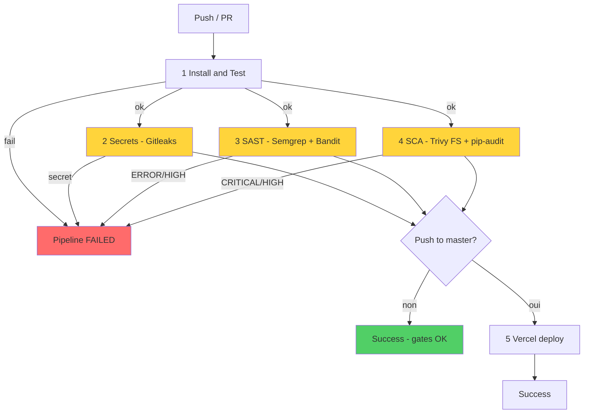

# Pipeline To-Be (après DevSecOps)

Pipeline sécurisé sur **GitHub Actions** (Jenkins retiré).  
Fichier : [`.github/workflows/devsecops.yml`](../.github/workflows/devsecops.yml)

## Diagramme

## Stages et seuils

| # | Job | Outil | Bloquant |
|---|-----|-------|----------|
| 1 | Install & Test | pytest + coverage | oui |
| 2 | Secrets | Gitleaks | oui (tout secret) |
| 3 | SAST | Semgrep + Bandit | oui (ERROR / HIGH+) |
| 4 | SCA | Trivy FS + pip-audit | oui (CRITICAL/HIGH) |
| 5 | Vercel | Vercel CLI | master + VERCEL secrets |

Images de scanners **épinglées** (pas de `:latest`) : gitleaks, semgrep, trivy.

## Démos attendues

Voir [`DEMO_BRANCHES.md`](DEMO_BRANCHES.md) : chaque branche `demo/*` échoue au job prévu ; `master` propre reste vert.

## Comparaison as-is vs to-be

| Critère | As-is | To-be |
|---------|-------|-------|
| Secrets | non | Gitleaks |
| SAST | non | Semgrep + Bandit |
| SCA | non | Trivy + pip-audit |
| Image | non | Trivy |
| Qualité tests | optionnel | bloquant |
| Déploiement | aveugle | après tous les gates |

## SonarQube

Optionnel en local via `infra/docker-compose.yml` (SonarLint). Non requis pour le vert CI sur GitHub Actions.
